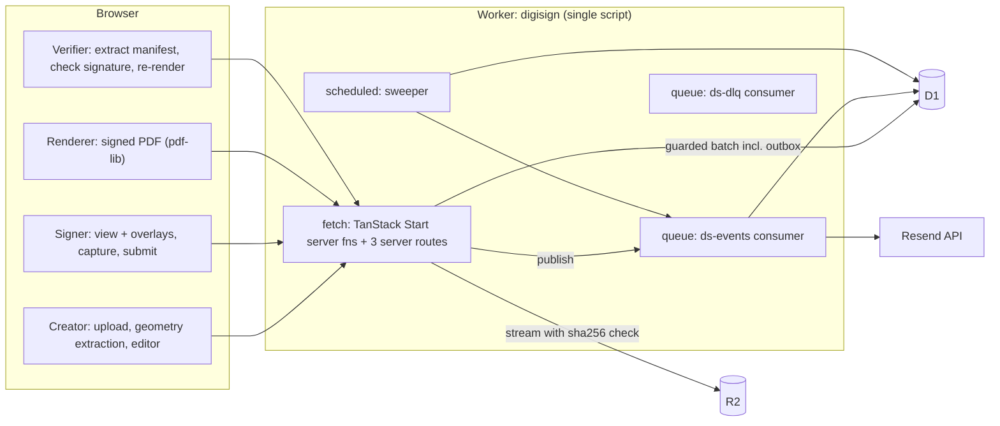
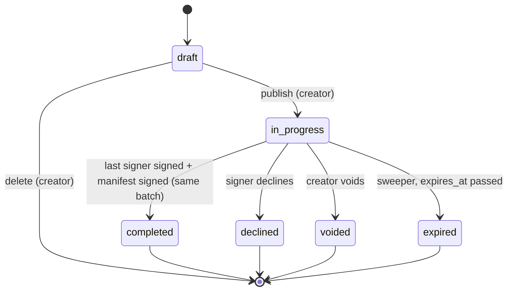

# DigiSign Masterplan — Architecture & Delivery Guide

> Status: **v2 — authoritative**. Supersedes `plan.md` where they conflict (see §1).
> Audience: every engineer/agent working on this repo. Read §0.1 (constraints) and §2 (invariants) before touching code.
> Stack: TanStack Start (React 19) on Cloudflare Workers **Free plan** · D1 · R2 · Queues · Cron Triggers · Resend (behind a `Mailer` interface) · pdf-lib + pdf.js (**browser only**) · signature_pad.

Conventions used in this document:

- **MUST / SHOULD / MAY** follow RFC 2119.
- `I-n` = invariant, `D-n` = decision, `R-x.n` = requirement for phase x, `S-n` = spike.
- "Spike" = a time-boxed experiment that must be run and its result recorded in §14 before dependent work starts.
- Phase details live in [`phases/`](./phases/) (index in §11).

---

## 0. Starting point

### 0.1 Product-owner decisions (binding)

| Topic | Decision | Consequence |
| --- | --- | --- |
| Hosting plan | **Workers Free** | 10 ms CPU per invocation (HTTP, queue consumer, cron), 50 subrequests and 50 D1 queries per invocation, 100 000 requests/day, Queues 10 000 operations/day with 24 h retention, D1 5 GB account / 500 MB per DB. **No PDF parsing, rendering or large hashing on the server.** |
| E-mail | Resend for MVP, swappable | `Mailer` interface; Resend adapter over `fetch`; dev adapter writes to a D1 mailbox. Configured late in Phase 3. |
| Signature type | Easiest thing that is still verifiable | **Server-signed evidence manifest** (Ed25519 via Web Crypto) + hash-chained audit log. PAdES/PKI signatures are out of scope (not feasible within 10 ms CPU, see D-4). |
| Limits | Accept proposed limits (§13) | Chosen so every browser-side PDF operation and every server request stays well inside memory/CPU budgets. |

### 0.2 Current state of the repository

| Area | State | Action |
| --- | --- | --- |
| Scaffold | TanStack Start + `@cloudflare/vite-plugin`, shadcn UI primitives, TanStack Query, Biome | Keep |
| DB driver | `drizzle-orm/better-sqlite3` with `DATABASE_URL=dev.db` | **Replace** — native Node module, cannot run in workerd. Use `drizzle-orm/d1` bound to `env.DB` (Phase 0). |
| Schema | `todos` demo table | Replace |
| Auth | `better-auth` instance with no database adapter | Leave untouched until Phase 4 |
| Wrangler | Single Worker, no bindings, `compatibility_date` 2025-09-02 | Add D1/R2/Queues bindings, cron trigger, custom server entry (queue + scheduled handlers), bump compat date |
| `plan.md` | Trailing chat artefacts after §11 | Clean up when convenient |

---

## 1. Review of `plan.md` — what we keep, what we change

### 1.1 Kept

- Strictly sequential signing; next signer invited only after the previous signer completed.
- Conditional-SQL state transitions with a `version` column.
- Page-local normalized coordinates.
- SHA-256 digests and a hash-chained audit log.

### 1.2 Changed

| # | Original | Problem | Replacement |
| --- | --- | --- | --- |
| C0 | pdf-lib in a queue-consumer isolate | Free plan gives 10 ms CPU per invocation; loading/stamping a PDF takes orders of magnitude more. | **All PDF work runs in the browser.** The server is the *evidence authority*: state machine, storage, audit chain, signed manifest. The signed PDF is a **deterministic rendering** of (original PDF + signed manifest) that anyone can reproduce and check (§9). |
| C1 | Print the final file's own SHA-256 inside the file | Impossible: writing the hash changes the file. | Verification is based on the embedded, server-signed manifest plus deterministic re-rendering (§9.4). |
| C2 | "DB write + enqueue" | D1 and Queues share no transaction. | **Transactional outbox** + cron re-publisher (§8.2). |
| C3 | `processed_messages` keyed by queue message id | Queues is at-least-once and unordered; re-published events get new message ids. | **Inbox** keyed by our own `event_id`, written in the same D1 batch as the handler's effects (§8.3). |
| C4 | Intermediate stamped PDF per signer | Needs server rendering. | Next signer sees the original PDF with prior signatures drawn as overlays from their (server-stored) signature data; the "state" they sign against is a hash over original + prior evidence (§9.2). |
| C5 | Loose coordinate definition, client page size | Undefined frame; CropBox offsets ignored; floats not canonical. | View-space integer micro-units; page geometry extracted by pdf.js at upload and **committed in the signed manifest** so a verifier can re-derive and compare it (§5). |
| C6 | Signature as client PNG | Unbounded image parsing, blurry, unverifiable. | **Vector strokes**, packed binary, bounded (D-3). |
| C7 | Plain SHA-256 audit chain | DB insider can recompute the chain. | Chain + **Ed25519-signed manifest/checkpoints** written to a **bucket-locked** R2 prefix (§10.3). |
| C8 | Raw magic token; "single-use" on GET | DB leak = credential leak; e-mail link scanners consume links. | Hashed tokens; explicit POST exchange for a short signer session (§10.4). |
| C9 | Signer state `viewing` | Idempotent, repeatable; creates races. | `first_viewed_at` + audit event. |
| C10 | D1 **or** Postgres; `jsonb` | Ambiguous. | **D1 only**; JSON as `TEXT` validated by Zod. |
| C11 | Separate consumer Worker | Only needed for pdf-lib isolation, which no longer runs server-side. | **One Worker** with `fetch` (TanStack Start), `queue`, and `scheduled` handlers via a custom server entry (S-4). |

---

## 2. Non-negotiable invariants

Each invariant MUST have at least one automated test that fails if it is violated.

- **I-1 No PDF engine on the server.** `pdf-lib`, `@pdf-lib/fontkit` and `pdfjs-dist` are importable only from browser-only modules (`src/pdf/**`, client components). The server bundle MUST NOT contain them (Biome `noRestrictedImports` + CI check on build output).
- **I-2 CPU budget.** Every server code path (HTTP, queue, cron) MUST stay under **7 ms p99 CPU** (30% headroom below the 10 ms limit). No server code parses PDFs, hashes large blobs, or loops over unbounded input. Enforced by bounds (§13) and CPU metrics (Phase 5).
- **I-3 Single source of truth.** D1 is the only source of truth for state. R2 holds immutable blobs referenced by (key, sha256) rows in D1. Queue messages carry **IDs only**.
- **I-4 Atomic mutations.** Every state change is exactly one D1 `batch()` (one SQL transaction) starting with a compare-and-set whose miss aborts the batch (§7.4). Batches stay ≤ 20 statements (the Free plan allows 50 queries per invocation).
- **I-5 Sequential signing.** At most one signer per document is `invited` (partial unique index). Signer *k* can only be invited when all lower-order signers are `signed`.
- **I-6 Frozen layout.** After publish, the layout, signers and original PDF of a document are immutable (DB triggers). `layout_sha256` and `geometry_sha256` are recorded in the audit chain and the manifest.
- **I-7 What you see is what you sign.** A signature submission MUST include the `stateHash` the signer was shown (§9.2); the server rejects it if it differs from the current state hash.
- **I-8 Geometry is committed, then verifiable.** The server cannot parse PDFs, so page geometry comes from the creator's browser (pdf.js). It is structurally validated by the server, frozen at publish, and included in the signed manifest; the verifier re-extracts geometry from the original PDF and MUST reject any mismatch.
- **I-9 Idempotent consumers.** Every queue handler is safe to run any number of times, concurrently, out of order; its D1 effects commit together with its inbox row.
- **I-10 Blob integrity without server hashing.** Uploads declare their SHA-256; the Worker streams the body to R2 with the `sha256` option so **R2 verifies it** (no hashing CPU in the Worker). Downloads carry the stored sha256; browsers verify before rendering.
- **I-11 Deterministic rendering.** Given the same original PDF bytes and the same signed manifest, the renderer MUST produce byte-identical output in every supported browser. The renderer version is pinned and recorded in the manifest.
- **I-12 Append-only evidence.** `audit_events` cannot be updated or deleted (triggers); manifests and checkpoints are written to a bucket-locked R2 prefix.
- **I-13 Secrets hashed at rest.** Magic tokens and session ids are stored as SHA-256 hashes; tokens never appear in logs.

---

## 3. System topology



### 3.1 Responsibilities

| Where | Does | Never does |
| --- | --- | --- |
| Browser | parse/render PDFs (pdf.js), extract page geometry, compute SHA-256 of uploads, place fields, capture signatures, render the signed PDF (pdf-lib), verify manifests | decide state; its outputs are always re-checked or committed as claims |
| Worker `fetch` | auth/session, validation of small bounded payloads, guarded D1 batches, streaming R2 in/out, Ed25519 signing of small manifests | parse PDFs, hash large blobs, render |
| Worker `queue` | dispatch next signer, send e-mail, notify completion, write checkpoints | heavy CPU |
| Worker `scheduled` | republish outbox, expire, remind, GC, small bounded batches per run | unbounded scans |

### 3.2 Queues (Free plan: 10 000 operations/day ≈ 3 300 messages/day; 24 h retention)

| Queue | Messages | Consumer settings |
| --- | --- | --- |
| `ds-events` | `dispatch_next`, `send_email`, `notify_parties`, `anchor_manifest` | `max_batch_size: 5`, `max_batch_timeout: 2`, `max_retries: 5`, `dead_letter_queue: ds-dlq` |
| `ds-dlq` | exhausted messages | `max_batch_size: 5` → persist to `dead_letters` |

Budget per 3-signer document ≈ 10 messages ≈ 30 operations → ~300 documents/day on Free. The sweeper MUST NOT generate queue traffic when there is nothing to do.

Platform facts (verified Sep 2026): at-least-once, unordered, ≤ 128 KB per message, `delaySeconds` ≤ 24 h; without a DLQ exhausted messages are discarded; a failed batch is re-delivered in full unless messages were individually `ack()`ed.

---

## 4. Domain model & state machines

### 4.1 Entities

`Document` (owned by a creator) → one original PDF blob · `geometry` (per-page boxes/rotation) · `layout` (fields, JSON) · ordered `Signer`s · each signer's `SignatureEvidence` · append-only `AuditEvent` chain · on completion one signed `Manifest`.

### 4.2 Document FSM



`draft` carries `upload_status ∈ {pending, uploaded, rejected}`; publish requires `uploaded` plus a geometry record.

### 4.3 Signer FSM

| From | To | Trigger | Guard (in SQL) |
| --- | --- | --- | --- |
| `pending` | `invited` | `dispatch_next` (queue) | doc `in_progress`; all lower-order signers `signed`; no other signer `invited` |
| `invited` | `signed` | `submitSignature` | `version` matches; doc `in_progress`; `stateHash` matches |
| `invited` | `declined` | `declineSignature` | doc becomes `declined` in the same batch |
| `pending`/`invited` | `voided` | doc voided/expired | cascaded in the same batch |

Status transitions are additionally enforced by `BEFORE UPDATE OF status` triggers that `RAISE(ABORT)` on anything not in these tables.

---

## 5. Coordinate system specification

Contract between editor, signing UI, API, renderer and verifier. Lives in `src/core/coords.ts` (pure, isomorphic).

### 5.1 Page geometry

Extracted in the creator's browser with pdf.js immediately after file selection, sent with the upload, frozen at publish, and embedded in the manifest.

Per page: `mediaBox`, `cropBox` (default = mediaBox), `rotate` normalized to `{0, 90, 180, 270}`.

- `viewBox = cropBox ∩ mediaBox` = `[vx0, vy0, vx1, vy1]` (PDF user space, origin bottom-left, y up) — matches pdf.js `view`.
- `bw = vx1 − vx0`, `bh = vy1 − vy0`.
- **View space** = the page as displayed: viewBox rotated clockwise by `rotate`, origin top-left, x right, y down; `(viewW, viewH) = rotate ∈ {90, 270} ? (bh, bw) : (bw, bh)`.

Server-side validation (cheap, structural): page count ≤ 200, each box has 4 finite numbers with positive extent ≤ 14 400 pt, `rotate` ∈ set. `geometry_sha256` = SHA-256 of the canonical geometry JSON (small).

### 5.2 Stored representation

Field rect `{ pageIndex, x, y, w, h }`, integers in **micro-units `[0, 1 000 000]` of view space**; `x + w ≤ 1e6`, `y + h ≤ 1e6`; no cross-page fields.

### 5.3 Frontend mapping

- Overlays positioned with percentages (`left: x/1e4 %`, …) inside a container covering the rendered page → zoom/DPR independent.
- Pointer → micro-units via the page element's `getBoundingClientRect()`, clamped, rounded. Pointer Events with capture.

### 5.4 View space → PDF user space (renderer)

With `u = x/1e6 · viewW`, `v = y/1e6 · viewH`:

| rotate | PDF X | PDF Y |
| --- | --- | --- |
| 0 | `vx0 + u` | `vy1 − v` |
| 90 | `vx0 + v` | `vy0 + u` |
| 180 | `vx1 − u` | `vy0 + v` |
| 270 | `vx1 − v` | `vy1 − u` |

Map both corners, take min/max. Content is drawn rotated so it reads upright in view space. **Oracle:** must match pdf.js `PageViewport.convertToPdfPoint` within 0.01 pt (property tests, all rotations, non-zero CropBox origins).

### 5.5 Fitting

Contain-fit (preserve aspect, centered) inside the field minus 4% padding of the smaller side.

---

## 6. Contracts and API surface

Zod schemas in `src/core/contracts/`, shared by browser and Worker. Every server input uses `.strict()` schemas with explicit bounds (§13). Zod ≥ 4.5 (lower memory per schema on Workers).

### 6.1 Key payloads

```ts
PageGeometry = { mediaBox: [n,n,n,n], cropBox: [n,n,n,n], rotate: 0|90|180|270 }
UploadInit   = { documentId, sha256: hex64, sizeBytes: int ≤ 25 MB, pageCount: int ≤ 200,
                 geometry: PageGeometry[] }                       // length === pageCount

FieldInput   = { id: ulid, signerId: ulid, pageIndex: int, kind: 'signature'|'initials'|'date_signed'|'full_name'|'text'|'checkbox',
                 x: int, y: int, w: int, h: int, required: boolean }
SaveLayoutInput = { documentId, layoutVersion: int, fields: FieldInput[] /* ≤ 300 */ }

// Drawn signatures are packed to keep server validation O(length) and cheap:
SignatureInput =
  | { kind: 'drawn', box: { w: int, h: int },
      strokes: string /* base64 of Int16Array: [nPoints, x0, y0, x1, y1, …] per stroke, coords 0..10 000 */ }
  | { kind: 'typed', text: string /* ≤ 64 */, font: 'script-1' | 'script-2' }

SubmitSignatureInput = { idempotencyKey: uuid, stateHash: hex64, consent: true,
                         values: { fieldId: ulid, signature?: SignatureInput }[] }
```

Server validation of `strokes`: base64 length bound first, then decode into an `Int16Array` and do a single bounds pass (≤ 64 strokes, ≤ 8 000 points, coords in range). No per-point object allocation.

Canonicalization: the server re-serializes validated objects with a canonical JSON encoder before hashing; only canonical forms are hashed and signed.

### 6.2 Endpoints

| Name | Kind | Actor | Effect |
| --- | --- | --- | --- |
| `createDraft` | server fn | creator | insert document (`draft`) |
| `initUpload` | server fn | creator | record declared sha256/size/geometry, return upload URL |
| `PUT /files/documents/:id/source` | server route | creator | stream raw body → R2 with `sha256` (R2 verifies); range-read first 1 KB to check `%PDF-`; `upload_status = uploaded` |
| `getDraft` | server fn | creator | doc + geometry + signers + layout |
| `saveSigners` / `saveLayout` | server fn | creator | full replace, CAS on `layout_version` |
| `publish` | server fn | creator | validation, freeze, `draft → in_progress`, outbox `dispatch_next` |
| `voidDocument` | server fn | creator | `in_progress → voided` |
| `GET /files/documents/:id/source` | server route | creator / active signer / holder of a read grant | stream original with Range support, `ETag` = sha256, `Cache-Control: private, no-store` |
| `exchangeSignerToken` | server fn | token holder | token → signer session cookie; called from the `/s/$token` page on button press |
| `getSigningContext` | server fn | signer | geometry, my fields, prior signers' evidence (for overlays), current `stateHash` |
| `submitSignature` | server fn | signer | §7.5 |
| `declineSignature` | server fn | signer | `invited → declined` |
| `getDocumentStatus` | server fn | creator/signer | polling target |
| `getManifest` | server fn | creator / any signer | signed manifest JSON (for rendering) |
| `GET /.well-known/digisign-keys.json` | server route | public | Ed25519 public keys (JWK) by `key_id` |
| `verifyManifest` | server fn | public | input = signed manifest envelope; verifies signature (≪ 1 ms), matches `manifest_sha256` and `source_sha256`; returns audit events (private fields hashed) and a short-lived **read grant** (HMAC-signed, 10 min) for `GET /files/documents/:id/source` so the verifier can re-render |
| `lookupDocument` | server fn | public | lookup by ID only (fallback when the attachment was stripped): public record summary; full private evidence only for authenticated creator/signers |

Every mutating server function accepts an `idempotencyKey` (§7.6).

**Server functions by default (D-17).** All application logic is exposed as TanStack Start server functions (`createServerFn`) with Zod-validated input and shared middleware (actor resolution, origin check, rate limit). Server routes are used **only** where a plain HTTP URL or raw streaming is technically required:

| Server route | Why a server function cannot do it |
| --- | --- |
| `PUT /files/documents/:id/source` | Server functions parse bodies (JSON/FormData); a 25 MB multipart parse buffers the file and costs far more than 10 ms CPU. The route pipes `request.body` straight to R2. |
| `GET /files/documents/:id/source` | pdf.js loads PDFs by URL with HTTP Range requests; server functions are RPC calls. |
| `GET /.well-known/digisign-keys.json` | Public keys must live at a stable, conventional URL for third-party verifiers. |

Page routes (not API): `/s/$token` (signer landing), `/sign/$signerId`, `/verify`, `/v/$documentId` (footer/QR target, pre-fills `/verify`).

---

## 7. Data layer on D1

### 7.1 Platform constraints (verified)

- `batch()` = one SQL transaction, sequential statements, all-or-nothing. **No interactive transactions**; Drizzle's `db.transaction()` is unusable — use `db.batch()`.
- Single-threaded per database; keep every query index-backed.
- Free plan: **50 queries per invocation**, 500 MB per database, daily row read/write limits that now **hard-fail** when exceeded (enforced since Sep 2026). Design for few rows written per operation.
- 100 bound parameters per statement; 2 MB max row; 100 KB max statement; 30 s max per query/batch.
- Read replication disabled (D-11). Time Travel: 7 days on Free.

### 7.2 Schema (MVP)

Conventions: ULID `id TEXT`; epoch-ms `INTEGER` timestamps; enums as `TEXT` + `CHECK`; aggregates carry `version` and `last_op_id`.

- `documents` — id, owner_id, title, status, upload_status, source_r2_key, source_sha256, source_size, page_count, geometry_json, geometry_sha256, layout_json, layout_version, layout_sha256, manifest_json, manifest_sha256, manifest_r2_key, anchored_at, expires_at, version, last_op_id, created_at, updated_at, completed_at.
  - Layout is stored as **one JSON column** (≤ 300 fields ≈ 40 KB) instead of one row per field: one write per save, trivially within the 50-query budget, and frozen by a single trigger.
- `signers` — id, document_id, signing_order, email, name, status, invited_at, first_viewed_at, signed_at, decline_reason, evidence_r2_key, evidence_sha256, consent_at, client_ip, user_agent, version, last_op_id. `UNIQUE(document_id, signing_order)`, `UNIQUE(document_id, email)`, `UNIQUE INDEX one_active_signer ON signers(document_id) WHERE status = 'invited'`.
- `signer_tokens` — token_hash PK, signer_id, expires_at, revoked_at, created_at.
- `signer_sessions` — session_hash PK, signer_id, expires_at, idle_expires_at, created_at.
- `audit_events` — (document_id, seq) PK, id, type, actor_type, actor_id, occurred_at, payload_json, prev_hash, hash.
- `outbox` — id PK, topic, type, document_id, payload_json, status (`pending|published`), attempts, available_at, created_at, published_at; index `(status, available_at)`.
- `inbox` — (consumer, event_id) PK, processed_at.
- `idempotency_keys` — (actor_key, key) PK, request_sha256, response_json, created_at.
- `email_deliveries` — id PK, event_id UNIQUE, to_addr, template, status (`claimed|sent|failed`), claimed_until, provider_message_id, attempts, updated_at.
- `dead_letters` — id, queue, body_json, attempts, error, created_at, replayed_at.
- `blob_intents` — r2_key PK, document_id, created_at. Registered before every pre-commit R2 write; the sweeper deletes intents (and their objects) older than 24 h that no D1 row references.
- `dev_mailbox` (dev only) — id, to_addr, subject, html, created_at.

**Where things live:** all state, the audit log, and the signed manifest are in **D1** (committed atomically). R2 holds blobs: the original PDF, per-signer evidence JSON, and **anchored copies** of manifests and checkpoints in bucket-locked prefixes (written only after commit).

### 7.3 Database-level guards (custom SQL migration)

1. `audit_events` update/delete triggers → `RAISE(ABORT)`.
2. Trigger on `documents`: once `status != 'draft'`, reject changes to `source_*`, `geometry_*`, `layout_*`; trigger on `signers`: reject email/name/order changes after publish (I-6).
3. FSM triggers on `documents.status` and `signers.status` (§4).
4. `CHECK` constraints for enums and bounds.

### 7.4 Guarded-batch pattern

A CAS `UPDATE` matching 0 rows succeeds silently, so the batch MUST be made to fail on a miss. **Spike S-1** decides:

- **(a) Assertion row:** `_assert(ok INTEGER NOT NULL CHECK (ok = 1))`; after each CAS `INSERT INTO _assert(ok) SELECT changes();`, final `DELETE FROM _assert;`. Requires `changes()` to reflect the previous statement inside a D1 batch.
- **(b) Predicated effects:** each dependent statement is `… WHERE EXISTS (SELECT 1 FROM <aggregate> WHERE id = ? AND version = ? AND last_op_id = ?)`, generated by the helper.

```ts
guardedBatch(db, { opId, cas: [...], effects: [...] }) → { ok: true } | { ok: false, reason: 'conflict' }
```

Ambiguous outcomes (transport error after commit): re-read the aggregate, compare `last_op_id` to `opId`.

### 7.5 Worked example — `submitSignature` (all within ≈ 2–4 ms CPU)

1. Resolve signer session. Rate-limit.
2. Validate input (bounded, packed strokes). Idempotency replay check.
3. Read signer + document (1 query each, or one join). Preconditions: doc `in_progress`, signer `invited`, `stateHash` equals the recomputed current state hash (§9.2 — computed from stored hashes, cheap), all required fields present.
4. Canonicalize evidence (signature values + consent + timestamps + IP/UA) → SHA-256 (small) → insert `blob_intents` row → `R2.put('evidence/{docId}/{signerId}/{sha}.json', bytes, { sha256 })`. **Blob first, reference second:** if the batch below fails, the blob is an unreferenced orphan (harmless, GC'd); a D1 row can never reference a missing blob. The key is content-addressed, so retries rewrite identical bytes.
5. Read audit head; compute next event hash.
6. `guardedBatch`: CAS signer `invited → signed` (+ evidence key/hash, version, last_op_id); CAS document `version`; insert audit event (`seq = head + 1`); insert outbox (`dispatch_next`, or completion path below); insert idempotency key.
7. **Completion path (last signer):** before step 6, build the manifest (§9.3) and sign it with Ed25519 **in memory**. The same batch stores `manifest_json` + `manifest_sha256` in D1, sets doc `completed`, adds the `document.completed` audit event, and inserts outbox rows `notify_parties(completed)` + `anchor_manifest`. Nothing is written to locked R2 storage before commit, so a failed batch can never leave an undeletable orphan. Decline, void and expiry transitions likewise enqueue `notify_parties` with their state in the same batch.
8. After commit: publish outbox (`ctx.waitUntil`). Respond `200 { status }`.
9. On conflict: re-read; `last_op_id == opId` → success; else `409`.

### 7.6 HTTP idempotency

Idempotency row inserted in the same batch; replay with same body → stored response; different body → `422`; 24 h retention.

### 7.7 Migrations

`drizzle-kit generate` → `migrations/` + custom SQL for triggers/partial indexes → `wrangler d1 migrations apply --local|--remote`. Forward-only; expand/contract for destructive changes.

---

## 8. Queue engine

### 8.0 What the queue is for (Free plan)

No PDF work runs on the server, so the queue carries everything that must **not** run inside a user's request:

- **External side effects that can fail or be rate-limited** — every e-mail goes through Resend (≈ 2 req/s on its free tier). The queue gives retries with backoff, a DLQ, and keeps request latency independent of the provider.
- **Workflow progression** — inviting the next signer after each signature (`dispatch_next`), so the signing request commits fast and the next step is retried independently if it fails.
- **Fan-out notifications** — completed / declined / voided / expired / reminder e-mails to every party.
- **Evidence anchoring** — writing signed audit checkpoints to the bucket-locked R2 prefix.

The atomicity guarantees (outbox, inbox, CAS) are identical to the original design; only the message types changed.

### 8.1 Envelope

`{ v: 1, eventId: ulid, type, documentId, subjectId?, occurredAt }` — ≤ 1 KB, IDs only.

### 8.2 Transactional outbox

- Outbox row inserted in the same guarded batch as the state change.
- Fast path: after commit `queue.send()` then mark `published`.
- Slow path (cron every minute, bounded to ≤ 20 rows per run): republish `pending` rows older than 30 s; re-emit `dispatch_next` for documents whose next signer is still `pending` > 10 min after the previous signature (lost-message recovery).
- The cron run MUST exit early with a single cheap indexed query when there is nothing to do (protects CPU, D1 reads and queue operations).

### 8.3 Consumer algorithm

```
for msg in batch:
  1. parse envelope; invalid → dead_letters, ack
  2. inbox has (consumer, eventId) → ack
  3. load aggregate; preconditions not met / stale / terminal → insert inbox, ack
  4. side effect (idempotent; e-mail via claim, §8.5)
  5. guardedBatch: CAS + effects + inbox + next outbox rows; conflict → re-read → ack or retry
  6. publish new outbox rows; ack
errors: transient → msg.retry({ delaySeconds: min(3600, 5·2^attempts) + jitter })
        permanent → record, ack, alert
```

Each consumer invocation also has 10 ms CPU and 50 subrequests: keep `max_batch_size` small (5) and do only I/O-bound work.

### 8.4 Handlers

| Handler | Preconditions | Work | Commit | Emits |
| --- | --- | --- | --- | --- |
| `dispatch_next` | doc `in_progress`; next signer `pending`; all previous `signed` | new 32-byte token, store hash | signer `pending → invited`, token row, audit | `send_email(invite)` |
| `send_email` | delivery not `sent`, not claimed | claim (CAS `claimed_until`), render template, `Mailer.send()` with `Idempotency-Key = event_id` | mark `sent` + provider id | — |
| `notify_parties` | doc in the terminal state named in the payload (`completed`, `declined`, `voided`, `expired`) or a signer due a `reminder` | one `email_deliveries` row per recipient (idempotent on `event_id + recipient`) | inbox | `send_email` × n |
| `anchor_manifest` | doc `completed`, `anchored_at IS NULL` | copy `manifest_json` (already signed) to `manifests/{docId}/{manifest_sha256}.json` (bucket-locked, content-addressed → idempotent); also sign and write the audit checkpoint `{docId, seq, headHash}` to `anchors/` | set `anchored_at`, `manifest_r2_key`, inbox | — |

E-mail is at-least-once by nature; the claim step plus the provider idempotency key make duplicates rare. Resend supports an idempotency key header — confirm during S-5.

### 8.5 Sweeper (cron, every minute, bounded work per run)

Republish outbox · re-enqueue `anchor_manifest` for completed documents with `anchored_at IS NULL` older than 10 min · GC unreferenced `blob_intents` older than 24 h (delete R2 object, then intent) · expire documents past `expires_at` · expire tokens/sessions · reminders · purge `idempotency_keys` (24 h) and `inbox` (≥ 48 h; queue retention is 24 h on Free).

### 8.6 Dead letters

DLQ consumer writes `dead_letters`, logs an alert-level event. Replay by script (later UI); safe by I-9.

---

## 9. PDF handling, rendering & verification (browser)

### 9.1 Upload

1. Creator selects a file. Browser checks size ≤ 25 MB, opens it with pdf.js (rejects encrypted/unparseable), checks ≤ 200 pages, extracts geometry, computes SHA-256 (Web Crypto).
2. `initUpload` records declared sha256/size/geometry.
3. Browser `PUT`s the bytes; the Worker streams `request.body` into `R2.put(key, body, { sha256 })` — R2 rejects mismatching bytes. The Worker then range-reads the first 1 KB to check the `%PDF-` header.

### 9.2 Signing view and state hash

- The signer's browser loads the original (verifying its sha256), renders with pdf.js, and draws prior signers' signatures as overlays from their evidence records (same drawing code as the renderer).
- `stateHash = SHA-256(canonical({ sourceSha256, geometrySha256, layoutSha256, priorEvidence: [evidenceSha256 in signing order] }))`. The server recomputes it from stored hashes (cheap) and requires equality on submit (I-7).

### 9.3 Manifest (the verifiable signature)

The manifest is a JSON document built **by the server only**, from D1/R2 records, when the last signer signs. It is then signed with the server's Ed25519 private key (a Worker secret). Anyone can check the signature with the published public key; changing a single byte of the manifest breaks it.

**Lean, public manifest (D-13).** The manifest is embedded in the PDF, and the PDF gets forwarded, so it carries **no readable personal data** beyond signer names. Emails, IPs, user agents and consent records live in each signer's private evidence record (R2 `evidence/…`, D1 `signers`) and are bound to the manifest by hash: changing private evidence breaks `privateEvidenceSha256`, which is inside the signed manifest.

```json
{
  "v": 1,
  "documentId": "01J…", "title": "…",
  "source": { "sha256": "…", "size": 482133 },
  "geometrySha256": "…", "layoutSha256": "…",
  "layout": [ /* frozen fields: id, signerOrder, pageIndex, kind, x, y, w, h */ ],
  "geometry": [ /* per page: mediaBox, cropBox, rotate */ ],
  "signers": [ {
      "order": 1, "name": "Alice …",
      "signedAt": 1759250000000,
      "values": { /* fieldId → signature strokes / typed text; needed to re-render */ },
      "valuesSha256": "…",
      "privateEvidenceSha256": "…"   // hash of { email, ip, userAgent, consentAt, invitedAt, firstViewedAt }
  } ],
  "audit": { "headSeq": 12, "headHash": "…" },
  "renderer": { "name": "digisign-render", "version": "1.0.0" },
  "completedAt": 1759251000000
}
```

Envelope stored and embedded: `{ "manifest": {…}, "keyId": "k1", "sig": "<base64 Ed25519 signature over canonical manifest bytes>" }`.

- Canonical JSON (sorted keys, no whitespace, integers only) is used both when signing and when verifying.
- The manifest contains only the audit **head**; because each event hash includes the previous one, the head commits to the entire chain. The full chain is verified via `/verify` (§9.5).
- Stored in D1 (`documents.manifest_json`, `manifest_sha256`) atomically with completion; then copied by `anchor_manifest` to R2 `manifests/{documentId}/{sha256}.json` (bucket-locked). `manifest_sha256` records exactly which manifest was issued. Size: tens of KB. Signing: well under 1 ms CPU.

### 9.4 Rendering the signed PDF (deterministic)

`render(originalBytes, signedManifest) → signedPdfBytes`, in the browser, with pinned pdf-lib and fonts:

- Draw each field's value (vector signature paths, typed signature with bundled font subset, server-provided `signedAt`/name for `date_signed`/`full_name`) using §5.4 mapping.
- **Footer on every original page:** `DigiSign · Document ID 01J… · Original SHA-256 a3f1…9c0d (shortened) · Verify at {origin}/v/{documentId}`. Drawn in a reserved strip at the bottom of the view space; fields MUST NOT overlap the strip (editor enforces).
- Append Certificate of Completion pages from manifest data: document ID and title, full original / layout / geometry hashes, per-signer name, order and `signedAt`, per-signer `valuesSha256` and `privateEvidenceSha256`, audit head (seq + hash), `keyId`, manifest SHA-256, verification URL and a **QR code** encoding it.
- Attach `digisign-manifest.json` (the signed envelope, byte-for-byte as issued by the server) as an embedded file. The browser only packages it; it cannot alter it without breaking the signature.
- Write the document ID into the PDF Info dictionary as a custom `DigiSignDocumentId` key.
- Fixed metadata (`CreationDate`/`ModDate` = `completedAt`, fixed Producer), no random IDs, deterministic object order → **byte-identical output** (I-11).

The signed PDF is **not stored** by default; any party can regenerate it on demand. (Optional later: cache the first rendering in R2.)

### 9.5 Verification (browser, `/verify`)

The dropped PDF **never leaves the browser**; only the manifest (or a document ID) is sent to the server.

1. **Identify the document**, trying in order: embedded `digisign-manifest.json` (pdf.js `getAttachments()`) → Info-dictionary `DigiSignDocumentId` → document-ID pattern in page text (footer/certificate) → manual ID entry.
2. **Check the signature** of the embedded envelope with the published key (`/.well-known/digisign-keys.json`, by `keyId`).
3. **Match against server records:** `verifyManifest` server function with the envelope → server re-verifies the signature, checks `sha256(canonical manifest) == documents.manifest_sha256` and `source.sha256 == documents.source_sha256`, then returns the audit events up to `headSeq` plus a short-lived read grant; the browser fetches the original via `GET /files/documents/:id/source`.
4. **Check the audit chain:** browser recomputes the chain from the per-document genesis hash and requires the result to equal `audit.headHash`.
5. **Check the original:** browser hashes it against `source.sha256`, re-extracts geometry and compares with `geometrySha256` (I-8).
6. **Check the visible file:** re-render with the recorded renderer version and compare bytes with the dropped file.
7. Result:
   - **Valid** — all checks pass.
   - **Records genuine, file modified** — steps 2–5 pass, step 6 fails (e.g. edited PDF, stripped attachment).
   - **Record found, no embedded manifest** — identified via metadata/text/ID only; the genuine record is shown for manual comparison.
   - **Invalid / not a DigiSign document** — signature or record checks fail, or no ID found.
8. Private evidence (emails, IPs, user agents) is shown only to the document's creator or signers when authenticated; the public view shows names, timestamps and hashes.

What this proves: the server attested who signed what, when, over which original; the visible PDF is exactly the deterministic rendering of that attestation. Limitation (accepted for MVP): trust anchors on the DigiSign signing key, not on a public PKI; PDF readers do not show a native "signed" badge (see Phase 6).

---

## 10. Security & tamper resistance

### 10.1 Threat model (MVP)

| Threat | Control |
| --- | --- |
| Signer forges coordinates / signs others' fields | Signer sends only field ids + values; fields must belong to the session's signer; layout frozen (I-6) |
| Creator lies about geometry to misplace fields | Geometry frozen, in manifest, re-checked by verifier against the original (I-8) |
| Signing a different state than shown | `stateHash` check (I-7) |
| Double/concurrent submit | Idempotency key + CAS + audit PK |
| Duplicate/out-of-order queue messages | Inbox + CAS (I-9) |
| CPU exhaustion / oversized payloads | Strict bounds, packed strokes, no server PDF work (I-2) |
| Tampered signed PDF | Signature check + deterministic re-render comparison (§9.5) |
| DB insider rewrites history | Append-only triggers, hash chain, Ed25519 manifests/checkpoints in bucket-locked R2 |
| Swapped/corrupted R2 blob | R2 `sha256` check on write; browsers verify sha256 on read |
| Stolen magic link | 256-bit token, hashed, expiry, revocation, rate-limited POST exchange, `Referrer-Policy: no-referrer` |
| CSRF / XSS | SameSite cookies + `Origin` check; strict CSP; React escaping |
| Enumeration | Rate limiting, uniform errors |
| Personal data leaking via forwarded PDFs | Lean manifest: no emails/IPs/UAs in the file, only hashes of them (D-13) |
| Stripped or replaced embedded manifest | ID also in metadata/footer/QR; server matches `manifest_sha256`; re-render comparison fails for edited files |

### 10.2 Audit chain

`hash = SHA-256(canonical({ documentId, seq, type, actorType, actorId, occurredAt, payload, prevHash }))`; genesis `prevHash = SHA-256("digisign:genesis:" + documentId)`. Optimistic append with PK `(document_id, seq)`.

Audit payloads MUST NOT contain raw personal data: emails, IPs and user agents appear only as SHA-256 hashes (raw values live in `signers`/evidence records). This lets `/verify` return the full event list publicly and still let anyone recompute the chain to `audit.headHash`.

Event types: `document.created`, `document.source_uploaded`, `document.published` (layout/geometry/source hashes), `signer.invited`, `signer.viewed`, `signer.signed` (evidence hash, state hash), `signer.declined`, `document.completed` (manifest hash), `document.voided`, `document.expired`.

### 10.3 Keys, manifests and anchoring

- Ed25519 private key as a Worker secret (`MANIFEST_SIGNING_KEY`, JWK), `key_id` for rotation; public keys served at `/.well-known/digisign-keys.json` (old keys retained forever for verification).
- R2 bucket-lock rules on `manifests/` and `anchors/` → cannot be overwritten or deleted without removing the lock rule.

### 10.4 Signer access

1. Invite link `https://app/s/{token}`; `GET` renders a landing page (no token consumption; safe for link scanners).
2. "Review & sign" → `exchangeSignerToken` server function (POST) → verify `sha256(token)` → signer session (hashed id; HttpOnly, Secure, SameSite=Lax; 30 min idle / 2 h absolute) → redirect to `/sign/{signerId}`.
3. Token valid until the signer is terminal or it expires (14 days); re-invite revokes old tokens.

---

## 11. Delivery phases

Each phase has its own file with scope, numbered requirements and **exit criteria** (all must pass before the next phase starts).

| Phase | File | Focus |
| --- | --- | --- |
| 0 | [phase-0-foundations.md](./phases/phase-0-foundations.md) | D1 driver swap, single-Worker entry, shared contracts, test harness, PDF fixtures |
| 1 | [phase-1-frontend.md](./phases/phase-1-frontend.md) | PDF viewing, geometry extraction, field editor, signature capture, signing UI, deterministic renderer |
| 2 | [phase-2-backend-core.md](./phases/phase-2-backend-core.md) | D1 schema + triggers, guarded batches, endpoints, R2 streaming, signer sessions, manifest signing |
| 3 | [phase-3-engine.md](./phases/phase-3-engine.md) | Queues, outbox, sweeper, DLQ, Mailer (Resend), checkpoints, verification page |
| 4 | [phase-4-auth.md](./phases/phase-4-auth.md) | Better Auth on D1, ownership, rate limits, security headers |
| 5 | [phase-5-hardening-launch.md](./phases/phase-5-hardening-launch.md) | CPU budgets, load/chaos tests, observability, backups, legal |
| 6 | [phase-6-post-mvp.md](./phases/phase-6-post-mvp.md) | Paid plan server rendering, PAdES seal, timestamps, parallel signing |

---

## 12. Testing strategy

| Layer | Tool | Focus |
| --- | --- | --- |
| Pure core | Vitest + fast-check | coords (pdf.js oracle), canonical JSON, FSM tables, packed-stroke codec, contract bounds |
| UI | Vitest + Testing Library | editor reducer, capture serialization, overlay positioning |
| Renderer | Vitest (browser mode) + Playwright | determinism across Chromium/Firefox/WebKit, alignment ±1 pt |
| Worker integration | `@cloudflare/vitest-pool-workers` | guarded batches, triggers, concurrency, handlers, fault injection, **CPU time assertions** |
| E2E | Playwright | full creator → signers → completed → download → verify flow |

Fault injection: test-only binding requesting "throw after statement k" / "throw after R2 put"; excluded from production builds.

---

## 13. Bounds & budgets (MVP; enforced server-side where the server can see the data)

| Item | Limit | Enforced by |
| --- | --- | --- |
| PDF size | 25 MB | browser + `Content-Length` + declared size + R2 object size |
| PDF pages | 200 | browser + geometry array length (server) + verifier re-check |
| Signers per document | 10 | server |
| Fields per document / per page | 300 / 40 | server |
| Signature field min size | 60 × 20 pt (initials 24 × 16 pt) | server (via geometry) |
| Drawn signature | ≤ 64 strokes, ≤ 8 000 points, coords 0..10 000, ≤ 48 KB base64 | server |
| Typed signature | ≤ 64 chars, 2 fonts | server |
| Request body (JSON server fns) | ≤ 128 KB | server |
| Token TTL / signer session | 14 days / 30 min idle, 2 h absolute | server |
| Document expiry | 30 days after publish | sweeper |
| Server CPU per invocation | p99 ≤ 7 ms | metrics (Phase 5) |
| D1 statements per invocation | ≤ 20 (hard limit 50) | code review + tests |
| Queue messages per document | ≈ 10 | design |

---

## 14. Decision log & spikes

### Decisions

- **D-1 D1 only.**
- **D-2 Queues + transactional outbox** for notifications/dispatch; Workflows not used (Free-plan step limits, extra state store).
- **D-3 Vector signatures**, packed binary on the wire.
- **D-4 Server-signed manifest (Ed25519) as the MVP signature.** PAdES needs a server-computed digest over the final PDF ByteRange (too much CPU on Free) or trusting a client-computed digest (not acceptable). Revisit on the Paid plan.
- **D-5 Deterministic browser rendering**; signed PDF regenerated on demand, not stored.
- **D-6 View-space integer micro-unit coordinates**, client-extracted geometry committed and verifiable.
- **D-7 "Viewed" is an event, not a state.**
- **D-8 Single Worker** with fetch/queue/scheduled handlers.
- **D-9 Magic links exchanged via POST.**
- **D-10 Layout stored as one JSON column** (fits the 50-query budget; single freeze trigger).
- **D-11 Read replication disabled.**
- **D-12 `Mailer` interface**; Resend adapter for MVP, dev mailbox adapter locally.
- **D-13 Lean public manifest.** Signed, readable, embedded in the PDF, but personal data (email, IP, UA, consent) is kept server-side and bound by `privateEvidenceSha256`. Encrypting the manifest was considered and rejected: it adds no tamper protection over the signature, removes public/offline verification, and adds key-management risk.
- **D-14 Audit head only in the manifest**; full chain verified via `/verify` by recomputation.
- **D-15 Embedded ID redundancy**: attachment + Info-dictionary key + footer text + certificate QR code.
- **D-16 No PAdES on the Free plan.** It needs server-side hashing of the final PDF (CPU) or trusting a client-computed digest (unsafe). Deferred to Phase 6 / Paid.
- **D-18 Signature reuse is device-local.** Signers need no account, so remembered signatures live only in the browser's `localStorage` as vector `drawn`/`typed` records; no server storage, no image uploads in the MVP. Evidence always contains a fresh value, so the server-side model is unchanged.
- **D-17 Server functions by default**; server routes only for raw upload streaming, Range-capable PDF download, and the public-key URL (§6.2).

### Spikes

| Id | Question | Needed by | Result |
| --- | --- | --- | --- |
| S-1 | Does `changes()` reflect the previous statement inside a D1 `batch()`? Choose guarded-batch mechanism. | Phase 2 | _pending_ |
| S-2 | `react-pdf` vs `pdfjs-dist` under React 19 + React Compiler + TanStack Start SSR (client-only), Vite 8 worker loading. | Phase 1 | react-pdf 11 views the PDF. pdfjs-dist 6.3.289 loads from a same-origin Vite worker URL. `/prepare` is client-only (`ssr: false`). Deploy was not part of this pass. |
| S-3 | pdf-lib output determinism across Chromium/Firefox/WebKit (compression, object order, metadata, attachment); fixes needed. | Phase 1 | _pending_ |
| S-4 | TanStack Start custom server entry exporting `queue` and `scheduled` alongside `fetch` with the Cloudflare Vite plugin (dev + deploy). | Phase 0 | Confirmed in dev. `src/server-entry.ts` exports TanStack Start `fetch` plus `queue` and `scheduled`. Bindings come from `import { env } from "cloudflare:workers"`; handlers do not take `env`. `pnpm dev` serves the app, `/cdn-cgi/local/scheduled` returns `outcome: ok` and writes a D1 probe, and a queue message is consumed locally. Deploy is not part of this pass. |
| S-5 | Resend over `fetch` from Workers: idempotency header, error codes, CPU per send. | Phase 3 | _pending_ |
| S-6 | Better Auth + Drizzle adapter on D1, per-request instance; CPU per session check on Free (password hashing cost!). | Phase 4 | _pending_ |
| S-7 | SSR CPU cost of TanStack Start pages on Free; which routes must be client-only (`ssr: false`). | Phase 1 | _pending_ |
| S-8 | Workers rate-limit binding availability on Free; fallback (D1 counter or WAF rule). | Phase 4 | _pending_ |

### Open items

- Legal disclosure/consent text and data-retention period (Phase 5).

---

## 15. Target repository layout

```
src/
  core/                 # pure, isomorphic (browser + Worker); no DOM, no bindings
    contracts/  coords.ts  canonical-json.ts  hash.ts  fsm.ts  limits.ts  strokes-codec.ts  manifest.ts
  pdf/                  # browser-only (I-1): pdf.js loading, geometry extraction, renderer, verifier
    load.ts  geometry.ts  render.ts  certificate.ts  signature-paths.ts  verify.ts
  components/
    ui/  pdf/  fields/  signature/
  features/
    editor/  signing/  verify/
  server/               # Worker only
    middleware/  documents.ts  uploads.ts  signing.ts  manifest.ts  verify.ts
    queue/              # consumer framework + handlers
    cron/               # sweeper
    mail/               # Mailer interface, resend.ts, dev-mailbox.ts
  db/
    schema.ts  client.ts  guarded-batch.ts  repos/
  routes/
  server-entry.ts       # fetch (TanStack Start) + queue + scheduled
migrations/
tests/
  fixtures/pdfs/  unit/  integration/  e2e/
```

Use the existing `#/*` import alias for `src/*`.
